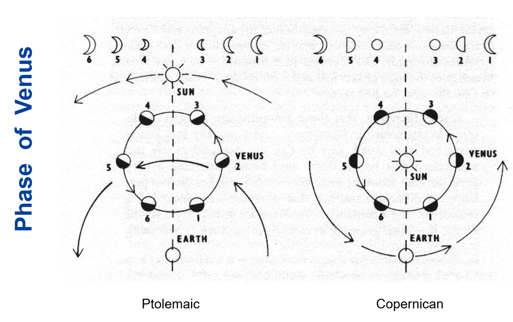
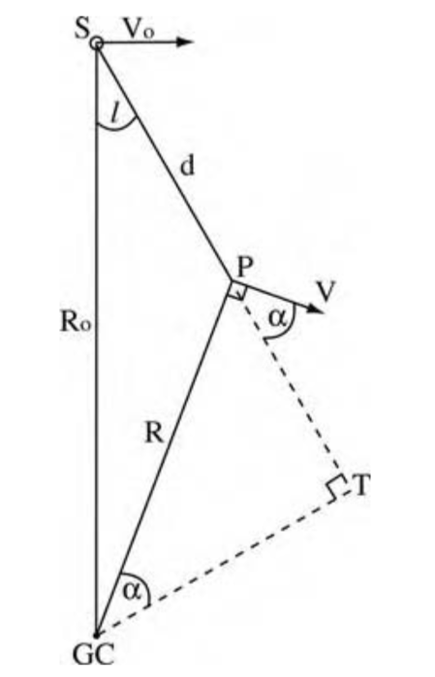

不知道怎么在博客网站上加载出来图片，索性就不放了，这是一个没有图片的Notes，如果需要图片的话，可以去我的Github上面把笔记和图片下载到本地，建议用Obsidian查看。

这是笔者在2026年春季学期学习的《现代天文学》课程的相关笔记，引用图片都是ppt上的，并且大部分内容都是我和AI斗智斗勇写下来的（晚上听不动了），也许会对复习产生一点微弱的帮助吧，后续还会更新

—— Siesta 2026/6/16

## Chapter 1 

**SN1054** 北宋时期观测到的超新星爆发
臣伏见自去年五月巳来。妖星遂见。仅及周稔。至今光耀未退。……不然。何以妖星谪变也。
	SN1054是一颗非常著名的超新星遗迹，也就是蟹状星云（Crab Nebula），她的爆发时刻被中国宋朝天文学家精确记录，从而提供了该超新星爆发事件的最重要的一个数据点。

**张遂（一行）** 为修编新历法。测出了子午线上每一度对应的距离
	一行精确测量了在相同经度，但不同纬度的四个位置的北极星高度角差别和地面距离差别的关系，他已经发现该关系为线性关系，即：角度每增加一倍，距离增加一倍。对于地球是**球形**的认知已经呼之欲出，但是很遗憾，一行的观测似乎主要是为了改善历法的精度，而没有得到一个更深刻、更具革命性的结论。

**金星的相图**：分为两种一种是哥白尼式（日心说），一种是托勒密式（地心说）

伽利略第一次观测了木星的卫星，并且记录下来

第一次观测金星相图，证实了日心说

**万有引力的地月验证**
	牛顿在《自然科学的数学原理》中，将自己发现的引力的平方反比率应用于地月系统，并获得了关键验证。通过研究月球向地球自由落体的加速度，再通过牛顿第一定律F=ma将引力与该加速度联系在一起，他发现该加速度a是地表引力加速度的3600倍，即地月距离和地球半径比例的平方。

**The Great Debate** **大辩论**，Curits和Shapley之间对于螺旋星云（如仙女座星云）是否属于银河系内部天体，
Sharpley主张银河系就是整个宇宙，Curirs主张存在类似于银河系的其他星系

就我们现在来说，Curits胜利了

**天文学上最有影响力的照片**
**暗淡蓝点** 旅行者一号飞船在1990年在60亿Km之外给地球拍了一张照片
![[暗淡蓝点.png]]
旅行者一号二号均已飞出太阳系，进入星际空间

## Chapter 2

**引力波的偏振效应**
	了解引力波的polarization（偏振）的概念，它指引力波在传播过程中，其空间畸变模式的方向性特征。具体来说，它描述了引力波如何影响时空的几何结构，以及这种影响在不同方向上的表现。
	引力波是由大质量天体（如黑洞或中子星）的剧烈运动（如碰撞或合并）产生的时空涟漪。这些波在传播时会引起时空的周期性拉伸和压缩，这种拉伸和压缩的模式就是偏振。
	偏振模式：  
	在广义相对论中，引力波有两种基本的偏振模式，称为 "plus"（+）模式 和 "cross"（×）模式：  
	传播特性：  
	引力波的偏振模式与传播方向垂直，且这两种模式之间相差45度。这与电磁波的偏振类似，但引力波的偏振是四极矩的，而不是偶极矩的。

**引力波观测的盲点**
	引力波观测的盲点仍然提供了重要的定位信息，这也是为什么Virgo探测器没有探测到该事件，却提供了重要的定位信息的原因。
**原因：**
	方向盲点：有特定方向的引力波观测灵敏度很低
	定位模糊：单台探测装置难以确定源的方向

**探测引力波**
2017年GW170817事件，LIGO（美国）先探测到**引力波信号**，在1.7秒之后，Fermi探测器（太空中）就观测到 **Gamma-Ray Burst (GRB）** 于是我们可以根据这个数据判断引力波的传播速度

**天体坐标**
**Right Ascension**
	赤经是天体在赤道坐标系中的经度坐标，类似于地球上的经度。  
	它以春分点（即黄道与天赤道的交点之一）为起点，向东测量。  
	赤经的单位通常用时（h）、分（m）、秒（s）表示，范围是 0h 到 24h，对应地球自转一周的24小时。
	  
**Declination**  
	赤纬  
	赤纬是天体在赤道坐标系中的纬度坐标，类似于地球上的纬度。它以天赤道为基准，向北为正，向南为负。  
	赤纬的单位是度（°）、角分（′）、角秒（″），范围是 +90° 到 -90°。+90° 对应天北极，-90° 对应天南极。

### **天文学的单位制**

天文比较习惯使用的单位制式**cgs单位制**，研究具体问题时可以采用特定的单位制
能量单位 erg （尔格）
$$
1erg = 10^{-7}J = 1 g·cm^2/s^2
$$
**一个超新星爆发释放的能量是$10^{51}erg = 10^{44} J$**

**常见单位：**
$$
\begin{aligned}
&1 Angstorm = 10^{-10}m = 10^{-8}cm \\\\
&1 AU = 1.4960 \times 10^{11} m \\\\
&1 ly = 9.4605 \times 10^{15} m \\\\
&1 pc = 3.0657 \times 10^{16} = 3.2616 ly = 206265 AU \\\\
&1Mpc = 10^6 pc\\\\
&1 Solar Mass \approx 2 \times 10^{30} kg\\\\
&1 Solar Luminosity = 3.826 \times 10 ^{33} ergs/s\\\\
&1^o = 60 ' = 3600''\\\\
&c = 1 ly/yr = 0.306 pc /yr
\end{aligned}
$$
**流量和光度**
	流量和光度的关系：光度是代表天体本征的发光能力，即单位时间发出的辐射能量。流量是光度传播到给定距离处的通量，即单位时间内，单位面积收集到的辐射能量。
我们使用光流量来判断恒星的亮度

**视星等和亮度**
	需要理解视星等和亮度之间的关系：亮度每差别100倍，视星等差别为5个星等，因此每一个星等差别对应的是2.512倍的亮度差别。视星等的基准是一套参考星网络，常用的标准是：织女星（0.03）、北极星（1.98）

织女星作为基准星有一些问题：
- 亮度不稳定
- 不同波段表现不一样
- 自身是一个高速旋转的扁球体

天狼星作为基准的一些问题：
- 天狼星是一个双星系统
- 天狼星有大量的金属

	恒星越亮 星等数值越小
	$$
	m_1 - m_2 = -log(\frac{E_1}{E_2})
	$$

**绝对星等和视星等**
	视星等和绝对星等的差别：绝对星等测量的是天体本征的发光能力，对应的是光度，绝对星等的操作定义是：天体如果被移动到离观测者10pc处，该天体在该10pc距离处的视星等就是它的绝对星等。
	$$
	E = \frac{k}{r^2}
	$$

**色差（Chromatic aberration）**
	色差是光学系统中由于不同波长的光（即不同颜色）在通过透镜或反射镜时折射率不同，导致它们无法聚焦在同一点上，从而在成像时产生颜色边缘模糊或色彩分离的现象。为了在望远镜设计中减少色差，现代望远镜都大多采用了牛顿的反射望远镜设计。

**艾里斑**
	Airy盘的半径即望远镜的分辨率，对于圆形孔径的望远镜，公式为PPT上列出的版本，需要记住，极其重要。
	$$
	\frac{1.22\lambda}{D}[radians] = \frac{0.252\lambda}{D}[arcsec\quad m/\mu m]
	$$
**视宁度**
	**视宁度**（Astronomical Seeing）是衡量**大气湍流对望远镜成像质量影响程度**的指标。简单来说，它描述了星星因为大气扰动而“闪烁”或“模糊”的程度。
	克服方法：
	- Lucky Image 拍摄大量图像 选择清晰度最高的一帧
	- 自适应光学调整摄影参数

**光谱分辨率**
	Resolving power: R 即光谱仪分辨率，定义为入射光波长除以在给定波长处的最小色散单元，R越大，光谱仪分辨率越高。
	$$
	R = \frac{\lambda}{ \Delta \lambda}
	$$
**Grism光栅棱镜**
	优势在于：成像（imaging）和 光谱观测可以使用同一套装置，区别在于有没有grism，我可以先得到一张不用grism拍的照片，然后再插入grism拍一张光谱照片，这样我就不需要移动我的装置

**灰尘的坏处：**
- 散射光子 和 让背后的东西变模糊
- 对于短波散射更多
- 吸收短波辐射放出长波辐射
**黄道光（zodiacal light）就是因为太阳系的尘埃散射阳光而导致的**

**哈尼天体（Hanny's Voorwerp）** 
	这是美国太空局使用哈勃望远镜拍摄到的临近的螺旋星系中的绿光气体团，天文学家称之为**恒星的诞生地** 
## Chapter 3 The Solar System

**第一位女性天文学家**：
**Caroline Lucretia Herschel**

**基本信息**：
从里到外排序：
水、金、地、火、木、土、天、海

按照大小排序：
木、土、天、海、地、金、火、水

**小行星带位于火星和木星之间**

**金星常常被认为是UFO**

自转最快的是木星，只需要不到10h就可以完成一个周期

自转最慢的是金星，约需要243天完成一个周期

太阳占据了太阳系99.9%的质量

太阳系距离银河中心的距离大约是8.2kpc

**太阳系在银河系的运动（章动）**
	太阳在围绕银河系转动的同时，也会在垂直银河系盘面的方向上下周期性振荡。具体来说，太阳每完成一个公转周期，会在垂直方向完成一个3次震荡。

**太阳系的轨道和地球轨道之间有夹角60度，地球自转轴和黄道面夹角为23.4度**
	这是南半球可以看见更加清晰的银河的原因之一，还有几点原因
	1. 空气透明度较北半球更高，没有严重的光污染
	2. 银河中心亮度高

**土星的光环**主要成分是冰，厚度只有9米左右

小行星带主要分布在木星和太阳组成的两体系统的拉格朗日点上，尤其是特洛伊带小行星，主要分布在L4和L5附近。
![[拉格朗日点.jpg]]

**柯克伍德空隙**是指小行星带中某一些轨道半径位置上，小行星数量明显稀少的区域
	**Kirkwood Gaps**的表现为在小行星的公转轨道半长轴的分布图上，部分半长轴对应的轨道周期和木星轨道周期成整数比，因此出现被清空的情况。在太阳系中，根据开普勒第三定律，轨道半长轴a和轨道周期T的关系是一一对应的，虽然课堂上没有推导，但学生需要掌握这两者之间的关系（高中物理知识）。
**原因**
	根本原因是**木星的引力扰动**，当小行星的公转周期和木星轨道成**简单整数比例**时，就会发生轨道共振。由于轨道是周期性的，所以引力作用可以进行累加，当木星的引力作用得到累加，就会使得小行星的轨道产生变化。
![[柯克伍德.png]]
**库伊伯带（Kuiper Belt）**
	库伊伯带的天体处于海王星轨道之外（距离为30-50AU），和小行星带（石块尘埃）不一样，库伊伯天体主要由冰组成，库伊伯带的形成时因为那些本可以形成一个行星的冰岩石，结果因为外部的引力作用，最后失败，形成了库伊伯带

彗星的**彗尾**主要由两种，一种为尘埃组成的彗尾，一种为等离子体组成的彗尾。尘埃尾是被太阳的辐射压推出轨道。等离子尾的方向是和太阳风的磁场有关，彗尾朝向太阳的反方向。

**太阳系的边界：日球层顶（Heliosphere）**，两艘旅行者号都已经穿越了日球层顶，旅行者1号在2012年，旅行者2号在2018年

**旅行者号金唱片（Voyager Golden Record）**
![[金唱片.png]]
**左上角告诉你怎么使用播放这个唱片，右上角教你如何解码视频信号**

左下角是地球的**宇宙坐标**：14条线代表14个已知的**脉冲星**，方向和脉冲周期已经使用二进制标注，外星文明可以使用这一些脉冲星来确定地球的位置。

右下角是**宇宙通用的时间基准**：这是氢原子的精细跃迁示意图

**太阳风**：太阳风的主要成分是被电离的氢气，即质子和电子，在太阳风磁场的作用下运动。
	太阳风球的形状主要由太阳风磁场提供的压力支撑。
	太阳风球内部的磁场保护地球不受大量 高能宇宙射线的侵扰。
	地球磁场同时又保护了地球不受太阳风电磁风暴的影响。

**轨道倾斜**：
	行星公转轨道的倾角非常小，几乎都在一个盘上运动，这告诉我们她们可能都诞生于同一个原初行星盘。

**行星组成的变化：**
	太阳系天体的化学构成有明显的随半径减小有渐进变化的趋势，从冰（易挥发态）、到气体（挥发态）、到岩质（不易挥发态）。**小行星带就象征了从气态（氢与氦）向不易挥发的岩石态的转变**

**星云假说**：原本太阳系还只是一个巨大的星云，主要是由氦气和氢气组成，加上一些微小尘埃，外界可能有超新星爆发，或者是另外的星体作用，导致了星云的坍缩，但是由于角动量守恒，星云转动的越来越快，离心力的作用让赤道方向上的物质不进行收缩，而两级进行收缩，最终在中心形成太阳，在外部形成行星。
	可以解释以下特性：
	**共面性**：几乎所有行星都在一个平面上运动
	**同向性**：所有的行星都在绕同一个方向绕太阳公转
	**组成物质的递变**
	**太阳的组成**

## Chapter 4 Extrasolar Planets (Exoplanets)

**恒星**HL Tau（金牛座 HL）被一圈原行星盘包裹，距离地球450光年，十分年轻，年龄小于10万年

在HL Tau周围有gaps，科学家使用模拟计算得到在这里会形成行星，但到现在还没有发现行星，说明行星还在形成之中

**如何观测行星盘**：行星盘周围会有阴影

LBT ( Large Binocular Telescope ) 是大型双筒望远镜

人类第一次确定发现系外行星：**1992年，天文学家在一颗编号为PSR 1257+12的中子星周围，发现了两颗（实际上是三颗）系外行星**

### 脉冲星
脉冲星是一种快速旋转的中子星，他的旋转周期十分稳定，这是宇宙中最好的钟

**它来自于大质量恒星，当大质量恒星耗尽燃料之后，会发生超新星爆炸，爆炸之后，恒星的核心会被压缩，形成一个密度极大，直径很小的星体——中子星**

脉冲星有极强的磁场。在两级发射辐射束，旋转速度很快，当他的辐射束扫过地球，我们可以接收到一个脉冲信号

### 发现系外星系的方法
- **视向速度（Ridial Velocity）**
- 直接成像（Direct Imaging）
- 天体测量学（Astrometry）
- 引力微透镜（Gravitational Microlensing）
- 凌星法（Transit）

#### 视向速度法
**视向速度**运用了多普勒效应：我们通过测量恒星的光谱变化，可以确定轨道信息
![[视向速度.jpg]]
这张图就很好的展示了如何使用多普勒效应来确定速度

太阳的视向速度
![[太阳的视向速度.png]]

视向速度法只可以告诉我们**行星质量的下限**，但这并不是它的真实质量
	因为视角问题，如果行星是侧边对着我们，那我们测出的就是真实的速度，但是如果行星是斜着的，那么我们只可以观测到**投影速度**
![[局限-视向速度.jpg|409]]
这种方法对于短周期的大行星比较适用，不太适合搜寻类地行星

#### 直接成像法
当行星遮住恒星的时候直接拍照；但该方法要求行星的自身尺寸要足够巨大，与母恒星的距离还不能近到被其光芒所掩盖 要求非常的敏感/日冕仪要做的很好
#### 天体测量法
**天体测量是通过长期、超高精度地测量恒星在天空中的位置变化和自行运动，来寻找其受行星引力拖曳而产生的微小摆动的一种探测方法。**
- **基本过程**：在一张长时间曝光的底片或数码图像上，有很多背景星。天文学家会测量目标星相对于这些背景星（假定它们几乎不动）的精确坐标。
- **目的是发现“晃动”**：如果一颗恒星受到看不见的行星引力拖曳，它就会沿着一条微小、周期性的波浪线运动（而不是直线）。天体测量要做的，就是**探测到这种微小的“摆动”**。
这种方法有利于确定远距离的的类地行星，需要长时间的观测

现代：盖亚（Gaia）卫星可以实现天体测量

#### 微引力透镜法
根据广义相对论，大质量天体会弯曲周围的时空，就像是给光加了一个透镜，当光经过大质量天体附近，会汇聚，使得单位面积光通量增大
这种方法需要出现引力透镜现象，较为罕见，并且探测到的行星系统无法重复观测
#### 凌星法
当行星经过恒星表面时，我们可以观测到恒星的表面亮度发生微弱的、周期性、短暂性的下降
![[数据-凌星.png]]

![[凌星法.png]]

**宜居圈**：
Orbital region around a star in which a planet can possess liquid water on its surface.

**透射光谱（Transmission Spectrum）**：利用凌星来分析行星大气中的化学成分，这样我们可以来判断这个星球是否宜居
	不同的成分会吸收不同波长的光，那么我们就可以通过分析光谱的变化来确定大气中的成分

**德雷克公式（Drake Equation）**
![[Drake.jpg]]
- $N$ 代表银河系内可能与人类通讯的[文明](https://zh.wikipedia.org/wiki/%E6%96%87%E6%98%8E "文明")数量
- $R_*$ 代表银河内[恒星](https://zh.wikipedia.org/wiki/%E6%81%86%E6%98%9F "恒星")形成的数量
- $f_p$ 代表恒星有[行星](https://zh.wikipedia.org/wiki/%E8%A1%8C%E6%98%9F "行星")的可能性
- $n_e$ 代表可能发展出生命的行星的平均数
- $f_e$ 代表以上行星拥有宜居环境
- $f_i$ 代表演化出高智生物的可能性
- $f_c$ 代表该高智生命能够进行通讯的可能性
- $L:$ 代表该高智文明的预期寿命
## Chapter 5 Stars

	A star is just a dirty ball of burning gas held together by gravity
		————Ying Zu

### 太阳

#### 太阳结构

**对流和辐射**：
![[对流和辐射.png]]

**太阳的结构**
![[Sun.png]]
Core - 日核：密度最大 温度最高
Corona - 日冕：太阳风从这里发出
Flare - 耀斑
Convective Zone - 对流层
Radiative Zone - 辐射层
Granule - 米粒组织
Sunspot - 太阳黑子
Penumbra - 半影
Umbra - 全影
Photosphere - 光球层：太阳温度最低的地方，也是我们看到的太阳表面
Chromosphere - 色球层 - 有许多太阳活动

**太阳黑子**的活动年限在**11年左右**

**临边昏暗（Limb Darkening）**
	现象：外面红里面白
	成因：光球层内部的温度比外部高，在中心区域你可以看到更深处的光，看边缘你只能看到更浅、更暗的外部区域
	我们看到的光可以近似看成都来自于 $\tau = \frac{2}{3}$ 的半径处，在中心区域光学深度小，在边缘区域大

#### 太阳辐射
太阳自转的周期随着纬度而改变，在两级自转周期最大，赤道最小
![[自转.png]]

#### 太阳振动
星震学（Asteroseismology）

在恒星内部有两种振动模式：P-mode（pressure）和G-mode（gravity）
P-mode类似于声波 G-mode类似于浮力
#### 平衡
一个稳定的恒星系统需要：

- 流体力学平衡：恒星的引力和压力要平衡，压力来自于气体的热力学压力 $P_{gas} = nkT$
- 能量平衡：太阳能的来源——p-p核聚变 （Fusion）这是质子-质子。核裂变是Fission![[fusion.png]]

太阳光谱就像是约等于5500K的黑体

**有关核爆炸爆炸波的研究**：
泰勒发表了一篇对于原子弹爆炸波分析的论文，他使用**量纲分析法**得到了爆炸波半径和一系列参数之间的函数关系![[Wave.png]]
我们提到过超新星爆发的时候会大约放出$10^{44} J$的能量，速度为$10^4 km /s$ ，我们可以得到：
$$
R \sim 0.3 \Big(\frac{t}{yr}\Big)^{0.4} pc
$$
**汤姆孙散射（Thomson Scattering）**：指光子和自由电子之间的弹性碰撞过程
**光子的随机游走**：
$$
s = \sqrt{Nl}
$$
平均来说，以光子需要走过1cm的路程才会碰撞产生电子，一个光子需要至少十万年才可以走出太阳的表面

**太阳的中微子问题**：我们观测到的中微子数量只有标准太阳模型理论预测的**三分之一**
	原因：中微子有不同的**味（flavors）**
	解决：中微子是有微小的质量的，核聚变只会产生电子中微子，但中微子之间可以相互转换，中微子会自发震荡成为不同的中微子：$\mu$子中微子、$\tau$ 子中微子，我们将这三种中微子累加起来就符合模型了
这一问题证实了中微子是有一定的质量的

**CNO循环（碳氮氧循环）** 也是恒星内部将氢聚变成为氦的一种方式，循环使用碳氮氧作为催化剂来促进反应进行。
	恒星质量较小（太阳一类）通常使用PP链来主导核反应进行
	质量较大的恒星（**质量大于1.3倍的太阳质量**）使用CNO循环来进行核反应

### **恒星的分类**

**恒星主序**：这是一个恒星演化的阶段，在这个阶段恒星处于稳定发光发热，在这个时期的恒星的光度大致和恒星的质量的3.5次方成正比：
$$
L = k \times M^{3.5}
$$
**恒星分类**：按照温度从高到低排序：
OBAFGKM

| 光谱型 | 颜色 | 表面温度 (K) | 典型特征（光谱线） | 代表恒星 | 质量 (太阳=1) | 寿命 |
|---|---|---|---|---|---|---|
|**O**|蓝色|> 30,000|电离氦线，紫外线强|参宿增三、心宿增一|> 16|< 1000万年|
|**B**|蓝白色|10,000 - 30,000|中性氦线，氢线开始出现|参宿七、角宿一、心宿二(伴星)|8 - 16|1000万 - 1亿年|
|**A**|白色|7,500 - 10,000|**氢线极强**（峰值），也有电离金属线|天狼星A、织女星、北落师门|2 - 8|1亿 - 10亿年|
|**F**|黄白色|6,000 - 7,500|氢线减弱，**电离金属线增强**（如Ca II）|老人星、南河三A、参宿四(超巨星)|1.2 - 2|10亿 - 40亿年|
|**G**|**黄色**|5,200 - 6,000|电离钙线极强，出现**中性金属线**（Fe I）|**太阳**、五车二|0.8 - 1.2|80亿 - 120亿年|
|**K**|橙色|3,700 - 5,200|中性金属线占主导，出现CH、CN分子带|大角星、毕宿五|0.5 - 0.8|150亿 - 300亿年|
|**M**|**红色**|2,400 - 3,700|**氧化钛分子带**极强，金属线丰富|比邻星、参宿四(超巨星)、巴纳德星|0.08 - 0.5|> 300亿年|
**氦闪（Helimu Flash）** 中小质量的恒星演化晚期发生的短暂的、剧烈的热核爆炸事件，标志着恒星从红巨星阶段向水平分支阶段的转变
	He-4被点燃。发生$3\alpha$过程（三个氦核聚变成一个碳核，并且释放能量）
![[能量.png]]

#### **造父变星（Cepheids）**

造父变星是变星（Variable stars）的一种，是一类高光度周期性的脉动变星，亮度随着时间呈现周期性变化，并且周期和光度呈现正关系（周期越大，光度越大）

北极星就是造父变星的一种

#### 为啥核聚变在铁停止了

铁是结合能的最高值，比铁重的原子结合会吸收能量

#### 超新星（Supernova——SN）

SN1054就是蟹状星云（Crab Nebula）

#### 恒星的死亡

![[Death.png]]
质量越大的恒星死的越早，就是在HR图中位于左上角的恒星

**我们可以根据恒星脱离主序的位置来判断星团的年龄**

## Chapter 6 Milky Way 银河

**绘制银河系**：
William Hershel 使用恒星计量来测绘银河系的形状：某一个方向上看到的恒星越多，就说明这个方向上的银河长度更长，边界更远。
	局限性：
	- 他将银河系中心定位为太阳系
	- 银河系中有大量的尘埃会阻挡视线

太阳系距离银河系中心大约是 $8.3kpc$ ，约为26000光年

**星系自转 Galactic Rotation** 里中心更近的恒星，在公转轨道上会跑的比我们快，里银心更远的恒星会到我们后面去

**奥尔特常数（Oort constant）** 是用来描述银河系在太阳附近局部自转特性的两个关键的观测参数
	A：衡量银河系**较差自转的强度** → 离银心不同距离的恒星转速不一样，导致相对太阳产生系统性漂移。
	B：衡量**局部角速度的大小**与**剪切** → 反映太阳附近恒星整体绕银心转动的快慢与 “旋转 + 剪切” 的综合效应。
$$
\begin{aligned}
V_r &= dA\sin(2l)\\
V_t &= d[A\cos(2l) + B]
\end{aligned}
$$
$V_r$是相对于太阳的径向速度，$A \approx 14.8km/s/kpc$，$B \approx -12.5km/s/kpc$, 当P在T点，径向速度是最小值

**银河自转曲线（Rotation curve of the Milky Way）** 
![[rotation.png]]
这个曲线可以证明宇宙中存在暗物质
	因为在远离银心的地方自转速度依旧很大，这就说明在银河系内有一种我们无法观测的物质在提供引力

**The Milky Way has a BAR**
	银河系属于棒旋星系，不是普通的漩涡星系，在银河系中心，一大群恒星拍成一个长条，横着穿过银心

**黑体辐射** 
![[black.jpg]]

**中性氢（Neutral Hydrogen）** 
![[图片4.png]]
F = 1 是高能态 电子和质子的自旋方向相同
F = 0 是低能态 自旋方向不同

当从高能态跃迁到低能态会发出光，波长为21cm

**同步辐射** 当相对论电子在磁场中运动会持续加速，会做螺旋运动，同时发出同步辐射，沿着螺旋线的切线方向

**热 HII 区** 指的是**由炽热的O型星（蓝巨星）或OB星协（一群大质量年轻恒星）强烈电离周围气体而形成的、温度极高的电离氢区**

**自由-自由辐射** 当一个自由飞行的电子，在途经一个离子（通常是质子）附近时，受到库仑力的吸引，运动轨迹发生偏折（被"拐了个弯"），从而释放出光子的过程。因为电子在辐射前后**都是自由**的，所以叫自由-自由辐射

**为什么选择CO作为示踪分子而不选择H$_2$**
	因为一氧化碳是**极性分子**，具有一定的电偶极距，并且激发能量较低，容易发光
	宇宙中CO含量较高

**费米气泡（Fermi Bubble）** 这是银河系上下两个巨型的堆成的椭圆状结构，内部充满了超高能量的Gamma-Ray 和 宇宙射线，两个气泡加起来的长度达到了50000光年

**逆康普顿效应** **一个低速光子从一个高速电子身上“抢”走了能量，从而变成了一个高能光子（如X射线或伽马射线）** 

**银河的结构** 
- 银心 Galactic Center 中心是一个超大黑洞
- 银核 Nuclear Bulge 
- 银盘 Disk 又可以分为 Thick 和 Thin ，Thick靠近中心，年龄更老（大于80亿年）
- 银晕 Halo 最古老的部分
- 球状星团 Globular Cluster 分散在外周
- 暗物质晕 Dark Matter Halo 质量很大，由于暗物质，边缘恒星才不会被甩飞
![[Milky way.png]]

## Chapter 7 Distant Galaxies

**M31 仙女星系** 这是距离我们最近的系外星系

**棒旋星系（Barred Sprial）的运动** 在旋臂中的恒星朝着同一个方向一起运动，但是在核中的恒星是朝着各个方向不规则运动的

**椭圆星系（Elliptical）** 和涡旋星系一样是对星系的分类，在内部恒星的运动是不规则的，向各个方向运动

还有其他形状的星系
- **不规则星系（Irregular）**
- **透镜状星系（Lenticular）**

**哈勃音叉图** 
![[Screenshot 2026-05-04 003547.png]]
 注意！！！ ：**哈勃音叉图不代表星系的实际演化路径，这个图只是给星系的形态进行一个分类**

但是我们相信星系是**从盘状向球状进化的，是从蓝向红色进化的**，从恒星形成到熄灭的，这就是**星系淬灭（Quenching）**
	淬灭是一种快速星系死亡方式，大约需要2亿年

我们使用CDM理论可以预测恒星死亡的事件，但是我们观察到大质量恒星和小质量恒星死的比预测值要早
	原因：
	大质量星系因为星系之内有很多黑洞，所以大量物质会被吸走，导致恒星死亡加速
	小质量星系因为大质量天体的死亡，发生超新星爆发，产生的物质喷射流吹走了大量物质，导致加速死亡

质量越大、颜色越红，淬灭的越早，反之淬灭的就越晚
![[1.jpg]]
从中我们可以看出早类星系几乎集中在红序上，质量偏大，颜色偏红，这说明他们是比较年老的
晚型星系主要分布在蓝云中，说明他们的恒星活动还很年轻

**星系死亡的方式** 
	超新星爆发：恒星燃料耗尽，最终坍缩形成中子星
	活动星系核：中心拥有超大质量的黑洞，吸收大量物质

**宇宙恒星形成历史Madau Plot**  
![[Madau.jpg]]
宇宙前期造星快 中期到达顶峰 后期变得缓慢

**Different types of IMFs（初始质量函数）** 
IMF描述了一个恒星群体在刚刚形成的时候，恒星质量在某一个质量区间内的分布情况

Top-heavy IMF（顶端重型）在极端环境中，低质量恒星的比例减少，而高质量恒星的比例增加。
Bottom-heavy IMF（底段重型）低质量恒星的比例增加

**Dust Extinction （尘埃消光）and Reddening（星际红化）** 是同一物理过程所产生的两种不同但是相关的观测效应。
	物理根源：尘埃颗粒，吸收光子的能量，然后再发射红外线；散射光子
红化：
	波长越短，吸收/散射越强，长波长光子更多的被保留，所以会偏红
消光：
	这是吸收和散射的总和，用光学波段的消光量来度量

## Chapter 8 Black Holes

**施瓦西半径**：一个物体的质量若被压缩到某一特定半径范围之内，这个物体将会坍缩成黑洞
$$
R_S = \frac{2GM}{c^2}
$$
一个太阳质量的天体的施瓦西半径是3km

**如何判断是黑洞还是中子星** 
	质量大于三个太阳质量：黑洞
	原因：中子星质量无法超过上限，否则会因为中子简并压而坍缩

**LIGO 测量引力波的技术：**
	 激光在壁中来回反射接近300次，将臂长等效增长为1200km
	 使用干涉模式来测量相移，而不是直接测量
	 对于一个1064nm的激光，一个$10^{-18}m$的位移可以产生$6 \times 10^{-12} radians$的相移 
	 LIGO可以对多个光子进行积分

**四种黑洞**
- SMBHS 超大质量黑洞在星系的中心
- IMBHS 中等质量黑洞在星团的中心
- Stellar BHS 恒星级黑洞在恒星残骸中
- PBHS 原初黑洞在大爆炸之后产生的

**霍金辐射**
主要思想：黑洞不是只进不出的天体，它会由于量子效应向外不断辐射能量，并且可能最后会蒸发耗尽。

**施瓦茨进动**
	广义相对论预言当一个较轻的天体在这样弯曲的时空中运动，它的轨道会受到一种推力，这就是施瓦茨进动

对于不旋转的施瓦西黑洞，**光子环**的半径是$R = 2.6R_S$， **黑洞阴影**的半径是 $R = 2.6R_S$
黑洞自转会导致一部分更加亮

## Chapter 9 Clusters 星系团

**炽热气体**：在星系团中弥散着温度极高（1亿摄氏度）的气体团，这些气体团会不断发射X-ray，在星系周围分布的低温气体团可以接收来自炽热气体团的质量而维持热平衡

**炽热气体的粘性很低**

### 星系团的形成

主流观点认为，星系团的形成是一种自下而上的过程（Bottom-up），许多的小星系群和暗物质晕形成，然后再进行组装合并得到大的星系团。

### 星系团的成分

一个星系团通常包括上千个星系(2%)，温度高达千万到一亿度的热气体（13%），以及一个巨大的暗物质晕（85%）：总质量超过10的14次方个太阳质量。

**Zwicky估算暗物质质量**：
先使用位力定理来估算星系团的总质量，然后估计星系团的总光度，取质光比为3，得到可见物质的估计质量，两者相比较，发现相差巨大，可见物质的质量仅仅占据全部质量很小一部分，于是得出结论，宇宙中还有很多看不见的物质在提供质量和引力，我们称之为 **暗物质**

### ICM 星系团内介质

**为什么这么热**：

- 引力势能释放
- 持续反馈jiare
- 冷却效率低

**Free-Free-Emission** 

自由自由辐射是ICM向外发射X-ray的主要方式，其原理是电子和离子完全电离，电子运动被粒子偏转而减速，从而发出电磁波，波段位于X-ray

**逆康普顿效应**：

高能电子可以与低能光子发生逆康普顿效应，让光子得到能量，星系团中的炽热气体中有很多高能电子，于是可以发生逆康普顿效应，让星系团中的光子蓝移，波长变短。

![[Screenshot 2026-06-01 132802.png]]

**热SZ效应>动SZ效应>旋转SZ效应**

**动SZ效应**：

星系团的本动速度产生的SZ效应

**旋转SZ效应**:

旋转速度带来的SZ效应

## Chapter 10 Dark Matter

宇宙70%的物质是暗能量，25%的物质是暗物质，5%的物质是我们平时见到的宇宙

根据牛顿定律，我们可以知道，旋转速度应该与距离的平方根成反比 $v_{rot} \propto \frac{1}{\sqrt{r}}$，但是在观测中，我们发现M31的旋转速度接近于常数
![[旋转速度曲线.png]]

**暗物质在我们的生活中是很稀少的**：
水的密度是：$\rho = 1 g/cm^3$
暗物质的密度是：$\rho = 10^{-24}g/cm^3$

### 引力透镜效应

根据爱因斯坦的广义相对论，大质量天体会扭曲光线，在宇宙中，我们在观察一个遥远星系的时候，如果在其中有一个大质量天体，遥远星系的光会被扭曲，我们将会看到放大的图像，类似于一个放大透镜。

#### 弱引力透镜效应

弱引力透镜会产生 **宇宙剪切** ，在特定的方向，遥远天体会被拉伸或变形

#### 子弹星系团

子弹星系团中炽热气体核暗物质的分布不重合，如图
![[子弹星系.jpg]]
红色的是炽热气体，蓝色的是暗物质分布。

这个例子告诉我们，暗物质大量存在并且几乎不与其他物质有相互作用

### 暗物质的性质

#### 暗物质的温度

暗物质的温度指的是，暗物质粒子运动速度的快慢，热的可能接近光速，冷的更加容易聚集形成小星系和天体。

暗物质越热，那么形成的纤维状结构就越少，星系团中的星系也就是越少

科学家通过模拟计算，拟合发现：冷暗物质模型和观测数据更加吻合，于是可以得到结论：暗物质粒子看不见摸不着，并且是冷的。

#### MACHO

MACHO原本是科学家为了解决暗物质到底是啥而提出的一种天体，我们可以通过观测远处恒星的光度变化来判断MACHO有没有经过光路，如果经过了光路，根据引力透镜效应，那么光度应该会突然提升。

#### 去哪里找暗物质：

去 **矮星系（Drawf galaxies）** 找
- 暗物质占比极高
- 没有背景干扰
- 距离遥远

## Chapter 11 Big Bang

宇宙一直在膨胀但是处于一种steady-state，宇宙膨胀会生成物质填充膨胀的空间，让已生成的宇宙处于一种稳定状态。

### Log N ~ Log S 关系

$$
\begin{aligned}
S &\propto D^{-2}\\
N &\propto D^3\\
N(S) &\propto S^{-\frac{3}{2}}
\end{aligned}$$
#### **奥尔伯斯佯谬**：
如果宇宙是静态的，恒星无限多且均匀分布在宇宙中，那么我们看到的白天和黑夜都应该是亮的，这与我们的观测结果相悖
	解释：光速有限，我们看到的远处的宇宙是很年轻的，宇宙的年龄是有限的。红移现象：大爆炸本身的辐射由于宇宙膨胀的原因而红移，成为宇宙的微波背景辐射。

### 光子红移
光子在宇宙中自由运动的过程中，随着宇宙不断膨胀，光子的波长也被拉长，产生了红移。

我们可以通过红移程度来看出这个光子从多远的地方传来。

我们可以使用波长比例来量化红移程度。
$$
	z = \frac{\lambda_{obs}- \lambda_{emit}}{\lambda_{emit}}
$$

**哈勃膨胀**
宇宙中的星体在不断远离地球，原理的称为退行速度
退行速度近似等于哈勃参数乘以距离：
$$
v = H_0 \times d
$$
目前我们可以使用$H_0 \approx 73 \text{ km/s/Mpc}$

哈勃参数不是常数，是随着宇宙演化而改变。

### Hubble Tension 哈勃张力

两种测量哈勃常数的方法，但是得到了两种不一样的结果

- 晚期宇宙测量法：使用 **宇宙距离天梯（Distance ladder）** 直接测量，得到今天哈勃常量的大小 $H\approx 73 \text{km/s/Mpc}$
- 早期宇宙测量法：使用 **宇宙微波背景辐射（CMB）** 间接测量，推算出来哈勃常量应该是 $H \approx 67.4 \text{km/s/Mpc}$

![[图片1.png]]

### **宇宙阶梯法测量天体距离**：

1. 使用无线电波，测量发射到反射回来的时间差，适用于极短距离
2. 使用视向速度，适用于近距离
3. 使用主序星拟合法，先找到一个已知距离的星团，将HR图画出，并且画出主序线，将目标天体的温度和视星等画在图上，进行平移，让两个图进行拟合，根据平移距离计算出距离。
4. 使用造父变星，造父变星的光度和其光变周期有函数关系，我们可以测量出视星等和光变周期，计算出距离。适用于中距离
5. 使用Tally-Fisher 关系，在一个漩涡星系中，星系总质量越大，其自转速度越快，并且质量和光度也正比关系，于是我们可以利用测量其旋转速度来算出其绝对光等。
6. 使用超新星光度计算，观察 **Is超新星** 爆炸，测量其视星等，计算出距离，适用于远距离
7. 使用红移法和哈勃定律，适用于极远距离

### **标准烛光** ：

**Is 超新星**，是因为两个白矮星相互作用，其中一个白矮星通过吸积物质，质量超过了钱德拉塞卡极限，导致其发生剧烈的热核爆炸，即超新星爆发事件，这个过程中，超新星的绝对星等基本一致，于是我们可以将这个视作 **标准烛光**。

### 爆炸核生成：

在宇宙大爆炸之后的时间内，大量自由质子、中子、电子等粒子互相碰撞，合成新的原子核。
其中 氦-4 的占比为25% 氢的占比为 75%

### 最后散射截面

在宇宙诞生指出，空间中有大量自由电子，这些自由电子会不断和光子碰撞，导致光子难以传播出去，那么在此前宇宙是不透明的，当核合成不断进行，粒子逐渐冷却，在一个瞬间，光子可以传播出去了，在这个时刻之后，宇宙变成了透明的，这些光子完成在早期宇宙的最后一次散射，所以叫做最后散射截面。

## Chapter 12 Cosmic Microwave Background

现在宇宙微波背景辐射相当于 $T = 2.74K$的黑体辐射。

## Chapter 13 Large-scale Structure of the Universe

